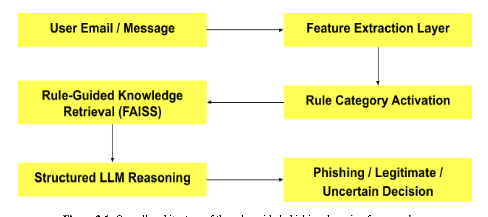
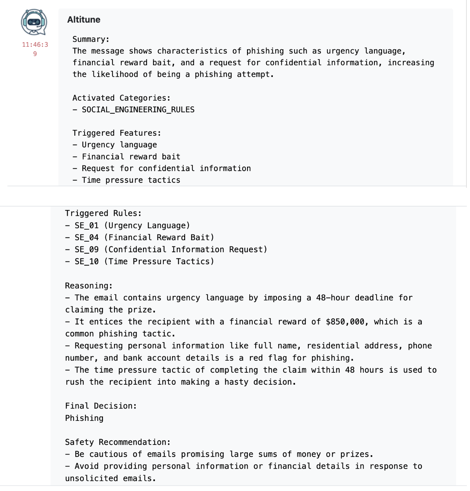
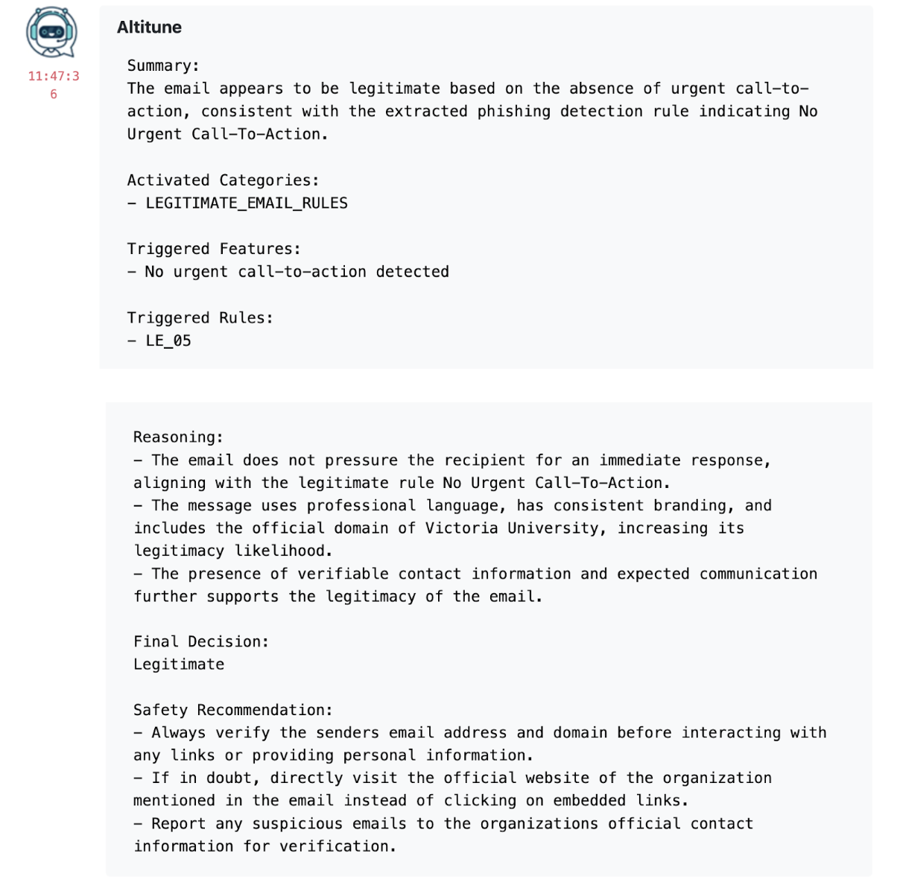

# LLM-Based Phishing Detection Chatbot (Rule-Guided RAG)

A rule-guided LLM framework that improves phishing detection explainability using feature extraction, FAISS retrieval, and structured reasoning.

---

## Problem

Traditional phishing detection systems are often black-box models, making it difficult to understand why an email is classified as phishing.

LLM-based approaches improve reasoning but suffer from inconsistent and unstructured outputs.

---

## Solution

This project proposes a **Rule-Guided LLM Framework** that integrates:

- Feature extraction (explicit phishing indicators)
- Rule category activation
- FAISS-based knowledge retrieval
- Structured LLM reasoning

This ensures the model produces **explainable and consistent decisions**.

---

## System Architecture

---

## Detection Pipeline

User Input → Feature Extraction → Rule Activation → FAISS Retrieval → LLM → Final Decision

---

## Key Features

- Rule-guided retrieval (improves RAG consistency)
- Feature-driven category activation
- Structured LLM reasoning output
- Explainable phishing classification

---

## Example Output

### Phishing Email Detection

### Legitimate Email Detection

---

## Results

- Accuracy: 79.4%
- Precision: 97.2%
- Specificity: 97.7%

---

## Tech Stack

- Python
- LangChain
- FAISS
- OpenAI API

---

## How to Run

1. Install dependencies
2. Run update_vector_data.py to build FAISS index
3. Run generate_answer.py
